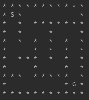
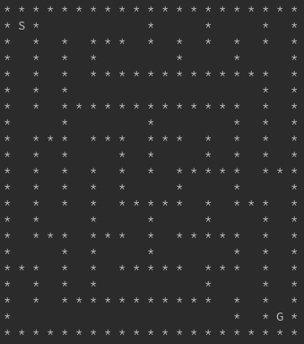
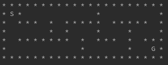

# Amazy
Amazy is a Python maze generator. It generates maze of various sizes.

    

# Usage
```
maze = Maze()
print(maze)
```
To create a maze of different size, pass in the number of rows and columns
```
maze = Maze(r=3, c=10)  # This creates a 3x10 maze
```

By default the "Start" is at the upper left corner and "Goal" is at the lower right corner. To change their locatins, modify the "start" and "goal" variables acoordingly.
